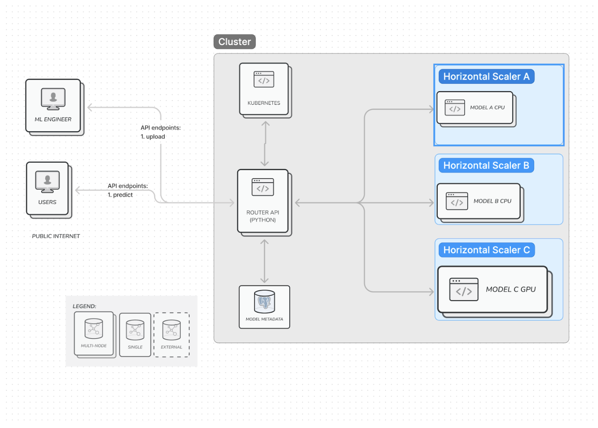
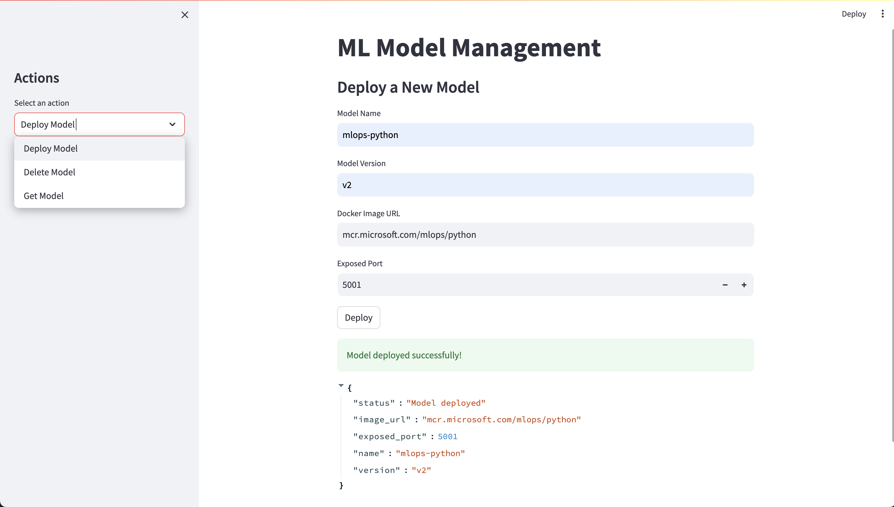

# BYOC Inference Platform on Kubernetes

## Problem Context

In machine learning, deploying and scaling inference workloads can be complex and time-consuming, requiring data scientists to manage infrastructure instead of focusing on model construction. The goal of this platform is to simplify this process by enabling data scientists to containerize their models and leave the scaling and deployment to the platform.

## Proposed Solution

The BYOC (Bring Your Own Container) Inference Platform runs on Kubernetes, leveraging its scaling capabilities. Data scientists simply need to Dockerize their models and push them to a registry. The platform takes care of deployment and scaling automatically.

### Key Features:

- **Router Pod**: Built with Python and FastAPI (potentially Go for better performance), the router pod handles incoming requests, determines the requested model, and routes them to the appropriate service.
  
- **Model Management**: Models are registered in a SQL database along with their container image URLs, names, and versions. Each model version runs in at least one pod.

- **Fault Tolerance**: In case of a system-wide crash, the platform can re-initialize the cluster based on the SQL database state.

### Goals:

- Provide reasonable latency and high throughput.
- Support multiple ML frameworks and versions.
- Scale models and their versions independently.
- Provide a simple UI for data-scientists to use

### Non-Goals:

- Optimize hardware for specific ML models.
- Inspect models to determine node-specific optimizations.

## Design

### Architecture Overview

### Components:

- **Router Pod**: Handles incoming requests and routes them to the appropriate model service.
  
- **Model Services**: Kubernetes services that manage model inference pods.
  
- **SQL Database**: Stores model metadata and container image URLs.
  
- **HorizontalPodAutoscaler (HPA)**: Scales model pods based on demand.
  
- **Container Registry**: Stores Dockerized model containers.

### Request Path

1. **Client Request**: Provides features, model name, and version.
2. **Router**: Routes request to the correct service.
3. **Service**: Loads balances to the pod.
4. **Inference Pod**: Performs model inference and returns the result to the client.

## Alternatives Considered

One considered alternative was to use a single image for all pods in the cluster. This approach, however, does not allow for per-model scaling and can lead to inefficiencies when large models are stored on every node.

## Future Goals

- **Garbage Collection**: Remove unused models automatically.
- **Pod Management**: Kill idle pods and launch them on demand.

## Parties Involved

- Aghilan Nathan - ML Infra @ LinkedIn

## Appendix

- [Link to Detailed Figures](#)
- [Additional Resources](#)
